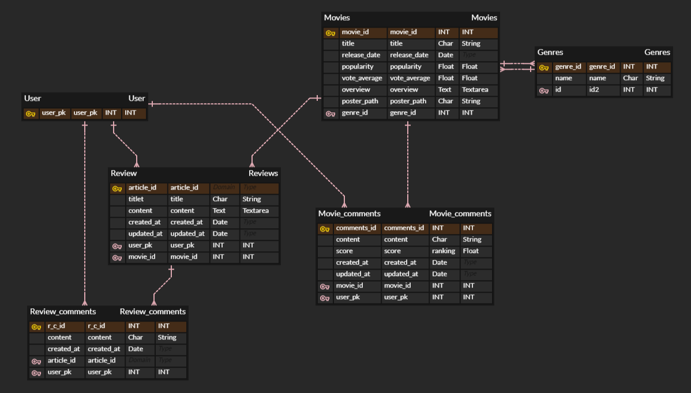
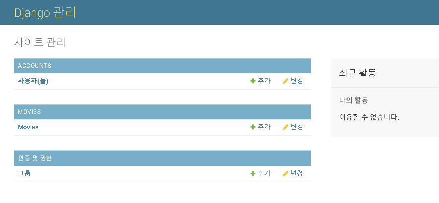
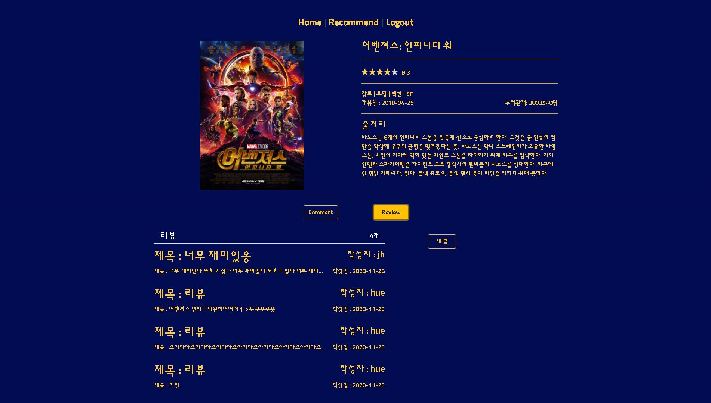
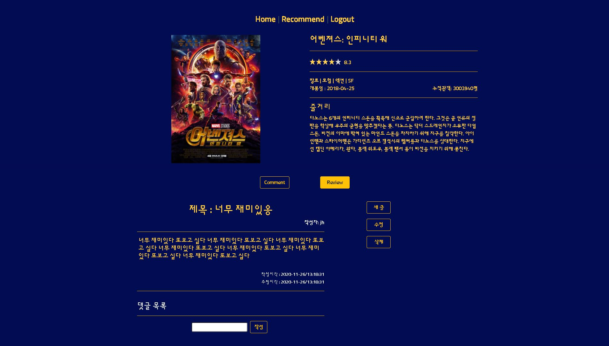
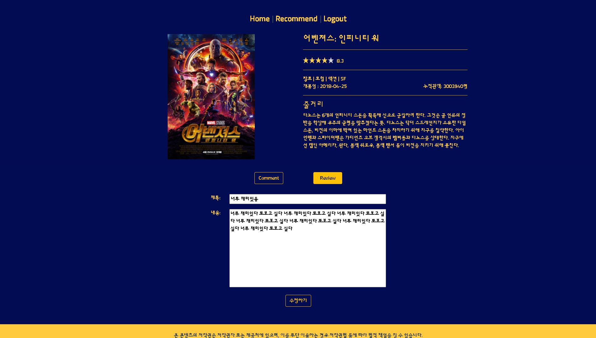
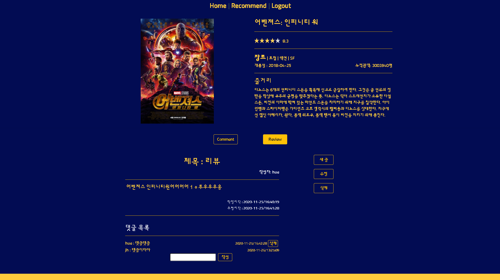
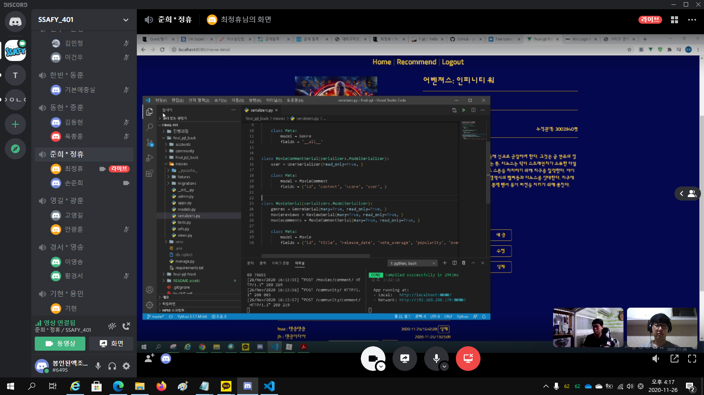
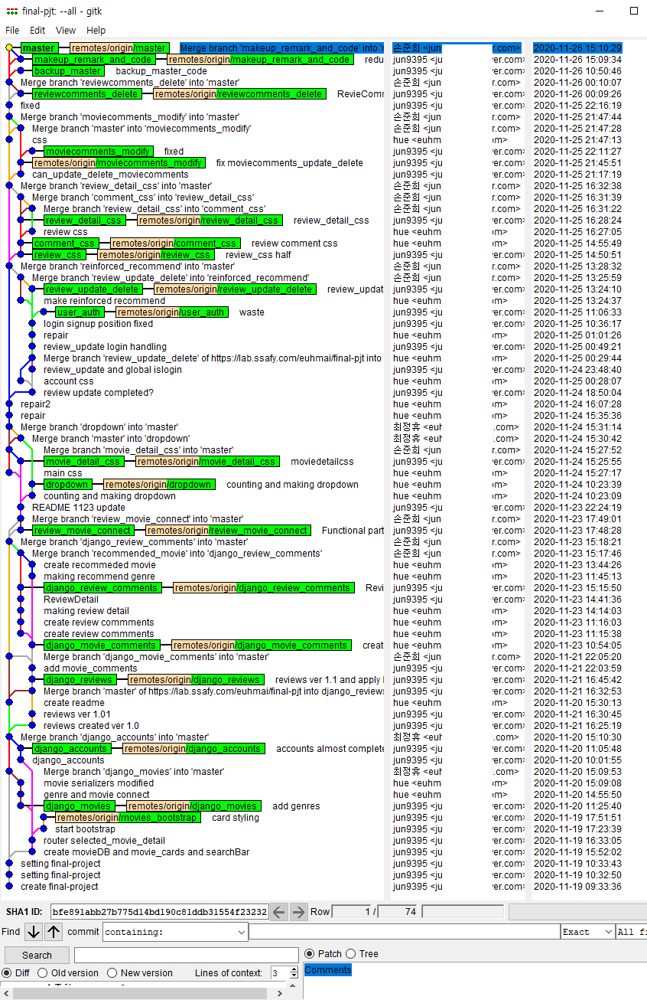
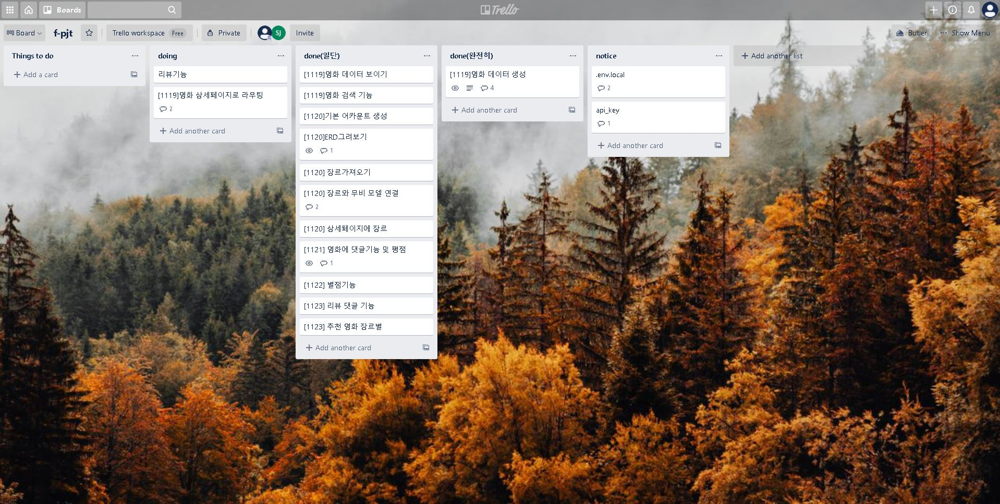
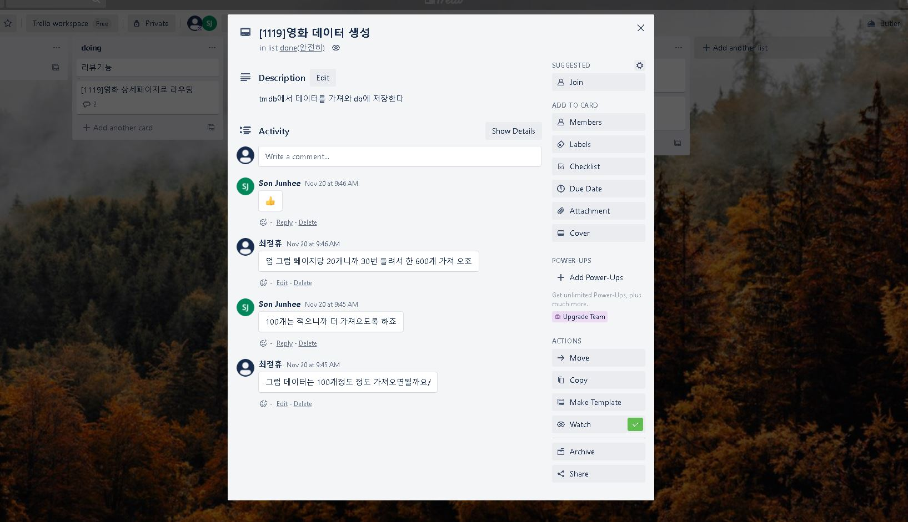

# Final-pjt


## 새롭게 배운것 & 느낀점


### 1. 시리얼 라이저

- 외부키로 정의된 내용을 시리얼 라이저 필드에 넣을때  객체 자체를 넣으려면 시리얼라이저 호출해서 넣어야함
- 호출 할 때 다른 앱이면 ..으로 상위 폴더 올리는거 아니고 해당 폴더에 바로 접근가능.
- 서로 호출해서 꼬이는 일 없도록 잘 조정해야함
- 꼭 잊지  말아야 할 read_only=True

### 2. 로그인을 위한 필수템 'JWT'

- 우리끼리 존맛탱이라고 부르는 JWT.

### 3. GET, POST등 요청방식에 따라 데이터를 넘길 수 있냐 없냐가 다르니 잘 선택할 것

- 더불어 api_view안 달아서 문제되는 경우도 많으니 조심

### 4. 함수, 변수 이름 잘 지을 것

- 함수나 변수가 몇개 없을땐 괜찮은데.. 많아지니까 진짜 많이 헷갈리더라. 길더라도 직관적으로 작성할 것
- 이름지을때나 커밋할때나 모르는거 검색할때 마져 언제나 걸림돌은 영어..

### 5. 역참조명 related_name사용시 유의사항

- 까먹었던 건지는 모르겠는데 뒤에 .all() 붙여야 한다. 안붙이면 None겁나 뱉음
- 찾아보니 .all() 외에 .value()같은 애들도 있더라

### 6. API_KEY

- API키를 보호하기 위해 pip에 decouple깔고, API키는 .env에 저장해야함

  ```python
  from decouple import config
  
  API_KEY = config('API_KEY')
  ```

### 7. vue

- 구조를 처음부터 잘짜야 안 힘들다
- vuex적극적으로 활용하자. 가까운 컴퍼넌트라고 emit, prop쓰다가 뭐하나 바꿀라면 아주 고생이다.
- class랑 :class 한꺼번에 쓸수있음
- 뷰색히 자꾸 만든거 안쓴다고 오지랖부리는거 짜증..
- 라우터로 variable routing하는거 공부좀 해봐야겠다.

### 8. style scoped

- 현재 컴퍼넌트에만 적용할때. 이거 시험나왔다던데 ㅋㅋ 틀림

### 9. 외부 컴퍼넌트

- npm에 깔아서 쓰는 외부 컴퍼넌트들 좋은거 많더라. 대신 쓰는법 익히는게 좀 어려울때가 있음

### 10. img

- src에 png넣어야 들어감 jpg안됨

### 11. 종합 소감

- 시작하기 전에는 진짜 걱정많이 했는데 끝나고 나니 너무 아쉽고 더 하고 싶은 마음이 크다.
- 같이 해준 준희랑 너무 잘 맞아서 좋았다. 준희 덕에 너무 많이 성장할 수 있는 시간이었고 덕분에 많이 배워 너무 고맙다.
- 협업에서 소통이 매우 중요함을 알게된 것 같다. 코드 거의 대부분을 함께 작업하고, 따로 작업하는 부분이더라도 항상 서로 의견을 공유하며. 퇴근 후 각자 짠 부분의 경우에도 다음날 작업 시작하기 전에 공유해서 서로가 코드의 대부분을 알고있다는 전제하에 협업을 진행하니 소통에도 문제가 없고 코드에 문제가 생겨도 쉽게 해결 할 수 있었던것 같다.


## 필수내용

### 1. 팀원 정보 및 업무 분담 내역

- 팀장 : 최정휴
  - 발표 및 프론트 전반 + 백엔드 보조
- 팀원 : 손준희
  - 백엔드 전반 + 프론트 보조


### 2. 목표 서비스 구현 및 실제 구현 정도

####  1) 영화 전체 페이지

| 목표 서비스                                      | 구현 정도     |
| ------------------------------------------------ | ------------- |
| 홈페이지 접속시 랜덤하게 10개의 영화 썸네일 출력 | 전부          |
| 썸네일 클릭하여 영화 상세 페이지로 전환          | 전부          |
| 제목, 배우, 장르 등으로 영화 검색                | 제목으로 검색 |


####  2) 영화 상세 페이지

| 목표 서비스         | 로그인 | 구현 정도            |
| ------------------- | ------ | -------------------- |
| 영화 상세 내용 출력 | 불필요 | 구현                 |
| 평점 기능           | 필요   | 댓글 기능과 통합     |
| 댓글 기능           | 필요   | 평점 기능과 통합     |
| 리뷰 작성 기능      | 필요   | 영화와 연동하여 구현 |
| 영화 즐겨찾기 기능  |        | 미구현               |


#### 3) 영화 추천 페이지

| 목표 서비스                                                  | 로그인 | 구현 정도  |
| ------------------------------------------------------------ | ------ | ---------- |
| 맨 처음 페이지 입장시<br>타로 카드처럼 랜덤하게 하나 추천    | 불필요 | 구현       |
| 영화 장르별 토글 버튼을 클릭하면<br>해당하는 장르의 영화 10~20개를 랜덤하게 추천 | 필요   | 4개로 구현 |
| 평점을 기록시, 해당 영화는 추천 목록에서 제외                | 필요   | 구현       |
| 평점 기능으로 평균 고득점을 기록한 장르를<br>기준으로 삼아 추천 | 필요   | 미구현     |
| 평점 기록이 적은 장르를 기준으로 삼아 추천                   | 필요   | 미구현     |


#### 4) 영화 리뷰 페이지

| 목표 서비스            | 로그인 | 구현 정도 |
| ---------------------- | ------ | --------- |
| 작성, 수정, 삭제       | 필요   | 구현      |
| 이전글, 다음글 보기    | 필요   | 미구현    |
| 덧글 작성, 본인만 삭제 | 필요   | 구현      |
| 리뷰 제목만 보기       | 불필요 | 구현      |


### 3. 데이터 베이스 모델링(ERD)




### 4. 필수 기능에 대한 설명

#### 1) 관리자 권한의 유저는 관리자 페이지에서 영화와 유저 관리 가능



#### 2) 영화정보는 TMDB API를 활용하여 300개의 데이터를 저장.


#### 3) 영화 평점 및 댓글 기능

1. 모든 로그인된 유저는 영화 상세페이지에서 댓글을 작성하며 평점을 등록. 본인의 댓글을 수정, 삭제 할 수 있다.
2. 작성된 댓글은 평점 5점 이상의 경우 추천해요. 5점 미만의 경우 비추해요 칸으로 나뉘어져 표현된다.


#### 4) 추천 알고리즘

1.  모든 유저는 영화 추천 페이지 메인에서 랜덤하게 하나의 영화를 추천 받는다.

   

2.  모든 로그인한 유저는 장르별 평점 상위 4개의 영화를 추천 받는다.

   

3.  영화에 평점 혹은 리뷰를 작성한 유저는 해당 영화를 더 이상 추천 받지 않는다.

4.  추천 할 영화가 없는 경우 슬프다.


#### 5) 리뷰 기능

1.  영화 상세페이지의 리뷰 탭으로 이동하면 리뷰 리스트를 볼 수 있다.

   

2.  리뷰리스트에서 리뷰 제목 및 내용을 클릭하면 리뷰 상세페이지로 이동한다.

   

3.  모든 로그인한 유저는 리뷰를 작성 할 수 있으며, 본인의 리뷰를 수정 및 삭제 할 수 있다.

   

4.  모든 로그인한 유저는 리뷰에 댓글을 달 수 있으며, 본인의 댓글을 삭제 할 수 있다.




### 5. 배포서버 URL


```
http://f-pjt-jhmovie.s3-website.ap-northeast-2.amazonaws.com/
```


### 6. 기타

#### 1) Driver & Nevigator 협업 방식을 이용하여 협업 진행



#### 2) 협업시 기능별로 git branch를 생성하고 merge를 이용하여 효율적인 git관리 방법을 익힘



#### 3) Trello를 활용하여 work board를 작성하여 효율적인 업무 관리 및 커뮤니케이션.







